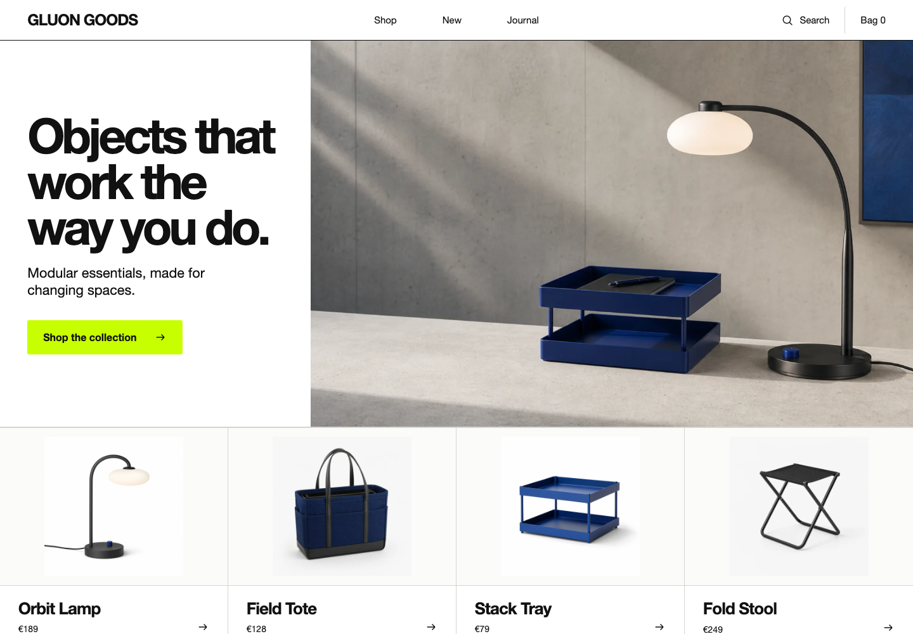

<!-- gluon-package-header:start -->
<p align="center">
  
</p>
<!-- gluon-package-header:end -->

<p align="center">
  A native-first UI system built on Custom Elements, HTML template literals, and adopted stylesheets.
</p>

> [!IMPORTANT]
> `1.0.6` is Gluon's first supported public release and is available for all 17
> official packages. npm publication occurs only from an immutable release tag
> through the protected release workflow; later repository commits cannot
> replace the published `1.0.6` package contents.

## What works today

- cached `html` and `svg` template results with part-level DOM updates
- child, attribute, property, boolean, event, and first-class spread bindings
- official browser, hash, and memory routing with typed locations and guards
- typed application-scoped stores with transactions, persistence, HMR, and SSR snapshots
- async boundaries/components, application-owned teleports, cached views, and transitions
- official Vite transforms with template source maps and state-preserving HMR
- DOM-independent SSR with isolated requests and safe serialized state
- public black-box component, Router, Store, and scheduler test utilities
- `create-gluon` project scaffolding plus deterministic app-local Atom, Molecule,
  Organism, stateful Custom Element, and headless generation
- shared HTML/SVG/CSS template diagnostics through an LSP, CI checker, and VS Code client
- deterministic, report-only Vue 3.5 source inventory through a Node package and CLI
- opt-in versioned Devtools with multi-application inspection and ordered runtime timelines
- a shareable Gluon Playground with live diagnostics, reference lookup, and starter download
- a living mobile-first GLUON GOODS reference shop built from public APIs
- a tested, reversible [Vue-to-Gluon cutover playbook](docs-site/content/1.0.6/migration/vue-to-gluon-cutover/index.md)
- nested templates, index-based arrays, and keyed `repeat()` reconciliation
- standalone DOM-free reactivity with refs, proxies, effects, and computed values
- reactive Custom Elements through `GluonElement`
- isolated application instances with plugins, providers, lifecycle, dynamic
  functional components, error boundaries, and controlled public exposure
- typed prop and event declarations, native/scoped slots, model bindings, and
  deterministic element, callback, component-host, and exposed-instance refs
- constructable `CSSStyleSheet` creation and `adoptedStyleSheets` adoption only
- typed `q.<tag>()` Quark factories for `HTMLElementTagNameMap`
- working Atom, Molecule, and Organism entry points
- typed native extension props, app-owned Button presets, and custom Icon
  definitions across the optional UI layers
- TypeScript declarations, an ESM library build, and real-browser tests

The repository includes a reproducible production comparison with Lit, Vue,
and optimized Vanilla DOM. The retained baseline does not establish that Gluon
is generally faster; see [Rendering performance evidence](docs/performance.md).

## Repository development

Work from a clean checkout:

```bash
npm install
npm run check
```

`npm run check` runs DOM-free Reactivity, Router, and Store Node tests, strict type
checking, the instrumented Chromium browser suite, all production builds,
public declaration contract tests, the lazy-route chunk check, and package
archive validation. It also installs, typechecks, tests, and builds all 20
supported `create-gluon` starter combinations from packed workspace artifacts.
The same gate also generates all five component kinds into clean universal
starters and verifies install, typecheck, template diagnostics, browser tests,
client/SSR builds, and package dry runs.

## Create an application

Interactive project creation uses the lockstep generator:

```bash
npm create gluon@latest my-app
```

Repository development can also run `node packages/create-gluon/dist/cli.js my-app`
after `npm run build:create-gluon`. Stable automation uses `--yes` and any of
`--router`, `--store`, `--testing`, `--ui`, or `--ssr`. SSR enables Router and
Store; explicit `--ssr --no-router` and `--ssr --no-store` combinations fail
before generation. See [the generator contract](packages/create-gluon/README.md).

The non-interactive UI path generates a complete themed, reactive application
with app-owned tokens, exact Button styles, computed-style browser evidence,
and deterministic owner cleanup:

```bash
npm create gluon@latest my-app -- --yes --ui --testing
```

Adding `--ssr` selects the maintained Router + Store universal starter and its
identity-preserving shared/exact/application stylesheet hydration regression.

Existing projects can run `create-gluon add-component` interactively or use
stable `--kind`, `--root`, `--path`, `--tag`, and `--dry-run` flags. Generated
file collisions require both `--overwrite` and the separate
`--confirm-overwrite`. See the
[app-local component generator](docs/component-generator.md).

## Quick start

```ts
import { render } from '@gluonjs/core';
import { q } from '@gluonjs/quarks';
import { Button, installUi } from '@gluonjs/atoms';
import { Card } from '@gluonjs/molecules';

const ui = installUi(document, { theme: 'light' });

render(Card({
  title: 'Hello Gluon',
  children: q.p({ children: 'Native elements, composed.' }),
  actions: Button({ label: 'Continue' }),
}), document.body);

ui.setTheme('dark');
// Call ui.dispose() when this application owner is destroyed.
```

Rendered components retain their own immutable stylesheet metadata before the
dependent DOM is committed. Applications do not import or order Atom, Molecule,
or Organism sheets. Deprecated aggregate exports throw
`GLUON_LEGACY_COMPONENT_STYLE_CONFLICT` when combined with renderer-owned exact
styles, preventing silent duplicate styling.

The same renderer can be used directly:

```ts
import { html, render } from '@gluonjs/core';

const view = (name: string) => html`<h1>Hello ${name}</h1>`;
render(view('world'), document.body);
render(view('Gluon'), document.body);
```

The second call updates the existing text part when the template shape is unchanged.

The [typed UI extension contract](docs/ui-extensibility.md) defines the stable
native-attribute/ref matrix, preset and custom-icon paths, application-owned
style hooks, and the exact metadata-only boundary of the component helpers.

## Keyed lists

Use `repeat()` when item identity must survive insertion, deletion, or a move:

```ts
import { html, repeat, render } from '@gluonjs/core';

interface Todo {
  id: string;
  label: string;
}

const view = (todos: readonly Todo[]) => html`
  <ul>
    ${repeat(
      todos,
      (todo) => todo.id,
      (todo) => html`<li data-id=${todo.id}>${todo.label}</li>`,
    )}
  </ul>
`;

const todos: Todo[] = [{ id: 'first', label: 'Try Gluon' }];
render(view(todos), document.body);
```

Keys are strings, numbers, or symbols. A key that survives an update retains
its Part, DOM nodes, Custom Element instance, listeners, refs, and local element
state. Removing it disconnects its renderer-owned bindings once. The contract
for invalid or changing keys is explicit:

| Input | Behavior |
| --- | --- |
| Duplicate key in one result | `repeat()` throws before `render()` can change the DOM. |
| `null` or `undefined` key from untyped JavaScript | `repeat()` throws before `render()` can change the DOM. |
| Key changes for an item | The old keyed child is removed and cleaned; a new child is inserted. |
| Ordinary array without `repeat()` | Template instances remain cached by array index, not item identity. |

Key functions and item renderers should be free of side effects. Stable keys
must come from item identity rather than the current list position.

## Standalone reactivity

`@gluonjs/reactivity` is a separate, DOM-free package for state that can be
shared by browser components, stores, and server code:

```ts
import { computed, effect, reactive, ref } from '@gluonjs/reactivity';

const count = ref(1);
const settings = reactive({ multiplier: 2 });
const total = computed(() => count.value * settings.multiplier);

effect(() => console.log(total.value));
count.value = 2;
```

Deep and shallow mutable or readonly proxies support plain objects, arrays,
`Map`, and `Set`. Effects track only the properties and collection operations
they read; computed values remain lazy and cached until a dependency changes.
The package also provides deduplicated pre/update/post scheduling, `batch`,
`nextTick`, untracked reads, effect scopes, scheduled watchers, deterministic
cleanup, and a contained error channel.

## Application-scoped stores

`@gluonjs/store` defines typed state, computed getter values, and actions without
a DOM dependency:

```ts
import { createStoreManager, defineStore } from '@gluonjs/store';

const counterDefinition = defineStore('counter', () => ({ count: 0 }), {
  getters: (state) => ({ doubled: state.count * 2 }),
  actions: (store) => ({
    increment(amount = 1) {
      store.count += amount;
      return store.count;
    },
  }),
});

const manager = createStoreManager();
const counter = counterDefinition.use(manager);
counter.increment();
```

Managers isolate browser applications, tests, and server requests. Actions and
patches publish inspectable before/after transactions; plugins can add
extensions and cleanup; versioned snapshots support safe serialization and
hydration; and compatible top-level state survives `hotUpdate()`. Persistence
requires an explicit storage adapter. See the [Store contract](docs/store.md).

## Async UI and rendering built-ins

Core provides deterministic asynchronous and cross-tree composition without a
second component model:

```ts
import { KeepAlive, Suspense, Teleport, Transition, html, nothing } from '@gluonjs/core';

const availability = Suspense({
  source: ({ signal }) => loadAvailability(productId, signal),
  fallback: html`<p>Checking availability…</p>`,
  children: (result) => html`<p>${result.label}</p>`,
  error: (_error, retry) => html`<button @click=${retry}>Retry</button>`,
});

Teleport({ to: document.body, children: dialog });
KeepAlive({ cacheKey: route.fullPath, max: 4, children: RouterView() });
Transition({ transitionKey: open, children: open ? dialog : nothing });
```

Async components add cached loading, failure, timeout, retry, and `preload()`
behavior. Teleport retains application context and cleans its external host.
KeepAlive suspends cached renderer resources and evicts least-recently-used
entries. Transition and TransitionGroup cancel stale Web Animations and honor
reduced-motion preferences. A public DOM-free descriptor is available to the
server renderer and progressive boundary coordinator. See [Async UI and
rendering built-ins](docs/async-ui.md).

## Black-box test utilities

`@gluonjs/test-utils` mounts functional components, Custom Elements, or complete
application templates through public Gluon APIs. Fixtures support typed props,
light-DOM slots, native events, providers, plugins, isolated memory Routers,
isolated Store managers, scheduler settling, owned external cleanup, and named
fixture-leak diagnostics.

```ts
import { cleanupFixtures, mountComponent } from '@gluonjs/test-utils';

const fixture = mountComponent(Counter, { props: { count: 1 } });
await fixture.setProps({ count: 2 });
expect(fixture.get('output').textContent).toBe('2');
await cleanupFixtures();
```

See the [`@gluonjs/test-utils` guide](packages/test-utils/README.md).

## Vite and state-preserving HMR

`@gluonjs/vite` records `html` and `css` template and interpolation locations,
reports adopted-stylesheet violations, and supplies high-resolution source maps.
During development it gives exported functions, Store definitions, registered
class and functional Custom Elements, and constructable stylesheets stable identities. Compatible
edits rerender mounted applications and elements without replacing their DOM or
compatible state.

For `defineGluonElement()`, compatible setup edits stop the previous setup child
scope and run the patched setup in the existing render owner. The registered
host, explicit keyed state, `ElementInternals` form state, ShadowRoot, compatible
template DOM, and stylesheet objects remain stable. Tag, form, property/event/
slot, superclass, and sheet-count schema changes require reload.

```ts
import { defineConfig } from 'vite';
import gluon from '@gluonjs/vite';

export default defineConfig({ plugins: [gluon()] });
```

Production builds do not receive the virtual HMR client or `import.meta.hot`
handlers. See the [`@gluonjs/vite` guide](packages/vite/README.md) and the
[tooling architecture](docs/architecture.md#vite-transform-and-hmr-boundary).

## Server rendering and request isolation

`@gluonjs/ssr` renders public `html` templates, functional components,
applications, async built-ins, and registered `GluonElement` definitions in
Node without a DOM implementation. Each `renderRequest()` owns a memory Router,
Store manager, detached reactive scope, and application and disposes all four
after success or failure.

```ts
import { createApp, html } from '@gluonjs/core';
import { renderRequest } from '@gluonjs/ssr';

const response = await renderRequest({
  url: '/reports/42',
  routes: [{ path: '/reports/:id', name: 'report' }],
  createApp: ({ router }) => createApp(() =>
    html`<main>${router.currentRoute.value.params.id}</main>`,
  ),
});
```

Dynamic content and state are safely escaped; event bindings and browser
lifecycle do not run. See the [`@gluonjs/ssr` guide](packages/ssr/README.md).
`@gluonjs/ssr/hydration` retains matching DOM while restoring events, refs,
context, Router, and Store state; categorized mismatches either recover with one
root render or abort before mutation. `@gluonjs/ssr/streaming` emits fallback
shells and nested abortable boundary patches. See [the hydration and streaming
contract](docs/hydration.md). `@gluonjs/ssr/static` and the universal Vite
manifest generate route-aware
static output, mixed dynamic fallbacks, resource hints, and initial style
carriers with adopted-sheet handoff. See [deployment](docs/deployment.md).

## Bindings and spreading

Gluon keeps bindings explicit:

| Syntax | Effect |
| --- | --- |
| `title=${value}` | Set or remove an attribute. |
| `.value=${value}` | Write directly to an element property. |
| `?disabled=${condition}` | Toggle a boolean attribute. |
| `@click=${handler}` | Add, replace, or remove an event listener. |
| `...=${props}` | Reconcile a complete prop set. |

Spread props support classes, styles, `data`, `dataset`, `aria`, property and boolean prefixes, event handlers, and callback or object refs:

```ts
const inputRef: { value?: Element } = {};

html`<input ...=${{
  class: { field: true, invalid: false },
  '.value': 'Ada',
  '?disabled': false,
  aria: { label: 'Name', invalid: false },
  data: { testId: 'name' },
  onInput: (event: InputEvent) => console.log(event),
  ref: inputRef,
}}>`;
```

Each expression must occupy a complete child or attribute value. Compose partial attribute strings before binding them.

Controlled form state uses property bindings such as `.value` and `.checked`;
uncontrolled initial/default state uses attributes such as `value` and
`?checked`. Multi-select controls accept an array through `.value`. Native event
options use `event(listener, options)`. Dynamic raw markup is text unless it is
explicitly wrapped with `unsafeHTML()`, and unsafe URL protocols are blocked
unless reviewed code opts out with `unsafeURL()`. The complete behavior,
including directives, namespaces, file inputs, form-associated elements,
suspension, and unmount cleanup, is defined in the
[DOM runtime contract](docs/dom-runtime.md).

## Custom Elements

`GluonElement` turns the renderer and stylesheet contract into a small reactive Custom Element base:

```ts
import { GluonElement, css, defineElement, html } from '@gluonjs/core';

class GreetingElement extends GluonElement {
  static override readonly properties = {
    name: { type: String, reflect: true, default: 'World' },
  };

  static override readonly styles = css`
    :host { display: block; }
  `;

  declare name: string;

  protected override render() {
    return html`<p>Hello ${this.name}</p>`;
  }
}

defineElement('gluon-greeting', GreetingElement);
```

`defineGluonElement()` is the concise path for the same autonomous boundary. It
infers primitive and structured properties, native event details, slots, form
APIs, and exposed host methods without a duplicate element interface plus
instance `declare` fields:

```ts
import { defineGluonElement, elementEvent, elementProperty, html } from '@gluonjs/core';

const QuantityControl = defineGluonElement({
  tagName: 'shop-quantity',
  formAssociated: true,
  properties: {
    product: elementProperty<{ id: string; price: number }>({ type: Object, required: true }),
    value: { type: Number, reflect: true, default: 1 },
  },
  events: { change: elementEvent<{ value: number }>({ cancelable: true }) },
  slots: { default: { required: true }, help: { fallback: true } },
  setup(context) {
    const value = context.state('value', context.props.value);
    context.onUpdated(() => context.form.setValue(String(value.value)));
    context.onCleanup(() => console.log('connection resources released'));
    return {
      expose: { focus: () => context.host.shadowRoot?.querySelector('button')?.focus() },
      render: () => html`<slot></slot><button>${value.value}</button><slot name="help"></slot>`,
    };
  },
});
```

Setup runs once per connected lifetime inside the existing element effect scope.
Explicitly keyed state survives reconnects and compatible HMR; computed values,
watchers, listeners, and cleanup registrations are recreated and released with
the connection. The class API remains supported. See the
[functional authoring RFC](docs/rfcs/0005-functional-custom-element-authoring.md).

Declared properties receive accessors, may reflect to attributes, and join
reactive values read during render on one scope-owned, update-phase scheduler
runner. Synchronous invalidations are deduplicated, `updateComplete` resolves
after commit, and disconnect stops owned effects while retaining state and
matching DOM for reconnection. The complete behavior and development render
diagnostics are defined in the
[Reactive Custom Element contract](docs/reactive-elements.md).

## Application runtime

`createApp()` owns one renderer root and reactive scope while keeping plugins,
providers, component registrations, configuration, warnings, and errors
isolated from every other application on the page:

```ts
import { createApp, createInjectionKey, html, inject } from '@gluonjs/core';

const greetingKey = createInjectionKey<string>('greeting');
const app = createApp(() => html`<h1>${inject(greetingKey)}</h1>`);

app.provide(greetingKey, 'Hello Gluon');
const mount = app.mount(document.querySelector('#app')!);
mount.unmount();
```

Application mount roots are persistent `Element` or `ShadowRoot` instances;
plain `DocumentFragment` objects are drainable and therefore rejected.

Application and component lifecycle, plugin cleanup, dynamic component
registries, error/warning ownership, event/async protection, and explicit
public exposure are defined in the
[Application runtime contract](docs/application-runtime.md).

## Application routing

`@gluonjs/router` supplies browser, hash, and DOM-free memory histories,
deterministic matching, typed named routes, guards, lazy route chunks, scroll
restoration, `RouterLink`, and `RouterView`:

```ts
import { createApp, html } from '@gluonjs/core';
import {
  RouterLink,
  RouterView,
  createRouter,
  createRouterPlugin,
  createWebHistory,
} from '@gluonjs/router';

const router = createRouter({
  history: createWebHistory('/app'),
  routes: [
    { path: '/', name: 'home', component: () => html`<h1>Home</h1>` },
    { path: '/team/:id', name: 'team', component: ({ route }) => html`${route.params.id}` },
  ],
});
await router.isReady();

const app = createApp(() => html`
  ${RouterLink({ to: '/', children: 'Home' })}
  ${RouterView()}
`);
app.use(createRouterPlugin(router));
app.mount(document.querySelector('#app')!);
```

Node and server code imports `@gluonjs/router/memory`, which does not expose or
evaluate browser history and UI bindings. The full API and navigation pipeline
are documented in the [Router contract](docs/router.md).

## Living reference shop

[`examples/shop`](examples/shop/README.md) is the canonical application
acceptance surface. GLUON GOODS is a coherent responsive shop—not a component
gallery—with real navigation, catalog and product URLs, product configuration,
search, and a reactive bag. Every applicable Gluon feature must improve this
same customer journey under the rules in [`AGENTS.md`](AGENTS.md).

```bash
npm run dev:shop
npm run build:shop
```



## Component contracts

`PropertyDeclarations<Props>` and `EventDeclarations<Events>` connect runtime
validation to TypeScript contracts without replacing browser-native Custom
Element properties and events. `SlotDeclarations` documents and checks native
slots, `renderScopedSlot()` covers caller-owned functional slots, and
`model()` provides controlled bindings for text, checkbox, radio, select, and
Custom Element models. Renderer refs resolve to real nodes; `exposedRef()` maps
a component host to only its explicitly exposed public object.

The complete validation, ownership, modifier, fallthrough, and cleanup rules are
defined in the [Component contracts](docs/component-contracts.md).

## Adopted stylesheets only

Gluon component styles are `CSSStyleSheet` instances. They are installed through `adoptedStyleSheets`; the library deliberately ships no `<style>` fallback:

```ts
import { adoptStyles, css } from '@gluonjs/core/styles';

const theme = css`
  :root { color-scheme: light dark; }
`;

adoptStyles(document, theme);
```

Browsers missing required capabilities fail with an explicit error instead of
silently switching styling strategies. Gluon 1.0 does not turn this capability
check into a branded-browser or platform support claim.

The accepted browser-engine evidence boundary and the server-to-browser style
handoff are defined by
[ADR 0001](docs/adrs/0001-browser-runtime-and-style-transport.md). SSR may
serialize marked initial style carriers inside Declarative Shadow DOM; after a
successful hydration handoff, Gluon removes those carriers and the hydrated
runtime again contains adopted stylesheets only. The shared UI owner validates
its named SSR carriers before consuming them.

## The system

Gluon is the base system. Its UI vocabulary increases in scope without changing rendering primitives:

| Layer | Current role and entry point |
| --- | --- |
| **Gluon** | Template runtime, Custom Element base, prop merging, and stylesheet adoption from `@gluonjs/core`. |
| **Quarks** | Typed native factories and headless interaction primitives from optional `@gluonjs/quarks`. |
| **Atoms** | Focused controls, tokens, and themes from optional `@gluonjs/atoms`. |
| **Molecules** | Reusable compositions such as `Card` and `FormField` from optional `@gluonjs/molecules`. |
| **Organisms** | Larger interface structures such as `AppShell` from optional `@gluonjs/organisms`. |

```text
                         increasing UI scope
  Quarks  ─────────▶  Atoms  ─────────▶  Molecules  ─────────▶  Organisms
 native elements      primitives          compositions          structures

                   Gluon provides the base system
```

Every component created with `defineAtom`, `defineMolecule`, or `defineOrganism` carries explicit `layer` and `displayName` metadata.

Quarks, Atoms, Molecules, and Organisms are optional `@gluonjs/*` packages.
Core exposes no UI subpath and a production tree-shaking fixture verifies that a
Core-only consumer contains none of the stable UI markers.

## Why Gluon?

The following points describe architectural advantages and design goals. Outcomes that depend on implementation—including rendering speed, runtime size, and developer ergonomics—must continue to be verified as the prototype evolves.

1. **A web-platform foundation.** Custom Elements are a browser standard, giving Gluon a native component boundary instead of a framework-specific component format.
2. **Framework interoperability.** Custom Elements can be consumed from plain HTML and integrated into frameworks that support them, making Gluon components useful beyond Gluon applications.
3. **Incremental adoption.** A standards-based component can be introduced one element at a time; an existing application does not need to be rewritten before it can use a Gluon component.
4. **Less framework-specific surface area.** The core model uses HTML, JavaScript, Custom Elements, and stylesheets rather than depending on a proprietary single-file component format.
5. **Declarative templates without another file format.** An HTML tagged template literal keeps declarative markup in JavaScript or TypeScript while avoiding an additional component-file syntax.
6. **Composable attribute sets.** First-class attribute spreading makes related accessibility, form, state, and configuration attributes easier to group, forward, and reuse.
7. **One styling contract.** Using `adoptedStyleSheets` exclusively gives the component system one explicit styling mechanism instead of several competing internal paths.
8. **Reusable stylesheet instances.** A `CSSStyleSheet` can be adopted by multiple compatible roots, allowing components to share a stylesheet instance rather than recreating identical style text for every instance.
9. **A design-system foundation.** Quarks, Atoms, Molecules, and Organisms give components named positions at increasing levels of UI scope.
10. **A consistent native-element layer.** Representing HTML elements as Quarks creates one place to define how native elements participate in Gluon composition.
11. **Focused UI primitives.** Atoms such as icons encourage small responsibilities, focused APIs, and isolated verification before primitives are combined into larger structures.
12. **A scalable composition vocabulary.** The same model covers native elements, primitives, intermediate compositions, and complete interface structures.
13. **Performance as an initial constraint.** Rendering work, updates, and allocations are considered during API design rather than treated only as later optimization. Any performance advantage remains unverified until reproducible comparative benchmarks exist.
14. **The potential for a smaller runtime.** Reusing browser-provided component, DOM, and stylesheet capabilities may reduce the amount of runtime code Gluon needs to provide. The resulting size must be measured against comparable systems.
15. **A distinct position.** The combination of Custom Elements, an HTML template literal, attribute spreading, adopted stylesheets, and the Gluon component vocabulary gives the project a specific direction relative to Vue- and Lit-style approaches.

## Architecture and provenance

- [Public versioned documentation](https://marcmalerei.github.io/gluon/)
- [Quality gates](docs/quality-gates.md)
- [Security threat model](docs/security.md)
- [Accessibility evidence](docs/accessibility.md)
- [Architecture](docs/architecture.md)
- [Gluon 1.0 product scope RFC](docs/rfcs/0001-gluon-1.0-product-scope.md)
- [Unified component and Custom Element model RFC](docs/rfcs/0002-unified-component-model.md)
- [Functional Custom Element authoring RFC](docs/rfcs/0005-functional-custom-element-authoring.md)
- [Report-only Vue migration analyzer RFC](docs/rfcs/0003-report-only-vue-migration-analyzer.md)
- [Bounded Vue codemod no-go decision](docs/vue-codemod-decision.md)
- [Browser, runtime, and style transport ADR](docs/adrs/0001-browser-runtime-and-style-transport.md)
- [Package, release, and supply-chain governance ADR](docs/adrs/0002-package-release-and-supply-chain-governance.md)
- [Release operations and protected publication runbook](docs/releasing.md)
- [Machine-readable package contract](package-contract.json)
- [Gluon 1.0 roadmap](docs/roadmap.md)
- [Runnable source example](examples/quick-start.ts)
- [Living GLUON GOODS reference shop](examples/shop/README.md)

## Current scope

Included now:

- browser-side rendering and updates
- standalone DOM-free reactive state
- application routing with browser, hash, and memory histories
- application-scoped stores with transactions, persistence, HMR, and snapshots
- a responsive living reference shop using public package APIs
- versioned guides, generated API reference with typechecked examples on every
  public symbol page, cookbook, migration material, and compiled interop examples
- static Vue 3.5 migration inventory with human/JSON reports and no source writes
- Custom Element authoring
- adopted stylesheet management
- Quark, Atom, Molecule, and Organism composition
- browser tests, type checking, and ESM builds

Not included now:

- islands
- Vue runtime/API compatibility, production SFC compilation, or source rewriting;
  the retained codemod evaluation proves no behaviorally equivalent writer class
- a supported performance-superiority claim
- branded browser, operating-system, device, or assistive-technology support claims

## Development

```bash
npm run typecheck
npm test
npm run test:coverage
npm run benchmark:keyed
npm run benchmark:rendering
npm run dev:benchmark
npm run build
npm run check:router-lazy
npm run check:packages
npm audit --audit-level=moderate
```

`npm run test:coverage` prints the V8 coverage summary and writes the ignored
HTML report to `coverage/`. `npm run benchmark:keyed` runs Chromium benchmarks
for reversing 1,000 surviving rows, moving a 100-row block, and replacing a
100-row window. These scenarios measure the Gluon implementation only and do
not support a comparison claim. Pass `-- --outputJson=path/to/results.json` to
write machine-readable local results. `npm run check:packages` validates every
planned package contract and the built export and pack contents of current
packages. `npm run check:router-lazy` verifies that an explicit lazy route emits
a separate production chunk. Run all project checks, including the coverage
thresholds and package contract, with `npm run check`.

`npm run benchmark:rendering` production-builds identical Gluon, Lit, Vue, and
optimized Vanilla DOM workloads, validates their output, then records 40
interleaved samples in Chromium, Firefox, and WebKit. Install the managed
engines with `npx playwright install chromium firefox webkit`. The methodology,
result format, limits, and interactive `dev:benchmark` page are documented in
[Rendering performance evidence](docs/performance.md). Current evidence must
not be generalized into an unsupported superiority claim.

## Contributing

The runtime exists, but the API remains experimental. Use [GitHub Issues](https://github.com/marcmalerei/gluon/issues) to discuss changes before implementation.

## License

[MIT](LICENSE) — Copyright © 2026 Marc Malerei.
