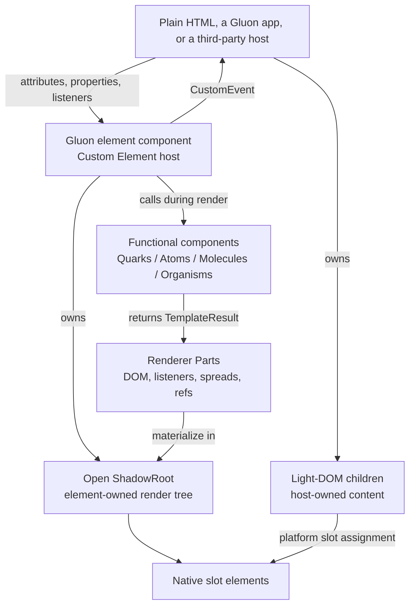
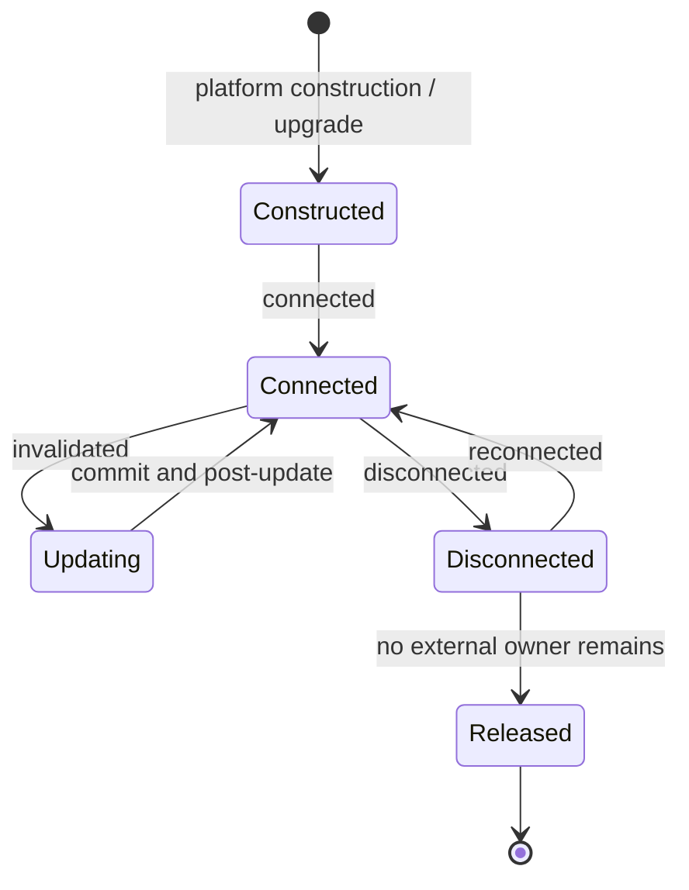

# RFC 0002: Unified component and Custom Element model

- **Status:** Accepted
- **Decision date:** 2026-07-10
- **Tracking issue:** [#15](https://github.com/marcmalerei/gluon/issues/15)
- **Roadmap tracker:** [#42](https://github.com/marcmalerei/gluon/issues/42)
- **Depends on:** [RFC 0001](0001-gluon-1.0-product-scope.md)
- **Supersedes:** Nothing

## Decision summary

Gluon has one component model with two roles:

1. A **Gluon element component** is a stateful autonomous Custom Element based
   on `GluonElement`. It owns a stable host element, an open ShadowRoot,
   reactive state, lifecycle resources, adopted stylesheets, and the public
   browser interoperability contract.
2. A **Gluon functional component** is a synchronous render function that
   returns a `TemplateResult`. It has no host element, registration, private
   render root, state instance, or lifecycle of its own. Quarks and the Atom,
   Molecule, and Organism layers use this role.

Functional components compose inside the render tree owned by an element
component or an application render root. Element components compose in that
tree by their autonomous Custom Element tag. Gluon will not introduce a second
framework-managed component-instance system for functional components in 1.0.

Custom Elements are therefore the state, lifecycle, styling, form, and public
interoperability boundary. Functional components remain the stateless
composition vocabulary inside an owning boundary.

## Why this decision exists

The repository currently contains both `GluonElement` subclasses and ordinary
Atom, Molecule, and Organism render functions. Both use the same template
runtime, but only `GluonElement` currently has an element identity, property
declarations, a ShadowRoot, connection callbacks, and adopted component styles.

Leaving their relationship implicit would create incompatible answers for
props, slots, lifecycle, refs, application context, HMR, SSR, and third-party
consumption. This RFC assigns every capability and resource to one owner before
the component and application APIs in issues #23 and #24 are implemented.

## Contract and current prototype

This RFC is the required Gluon 1.0 contract, not a claim that the current
prototype already implements every rule. The repository has these verified
gaps at the decision date:

| Required contract | Current prototype | Delivery |
| --- | --- | --- |
| A captured pre-upgrade property takes precedence over the initial attribute. | `GluonElement` captures an own property, but a later upgrade-time attribute callback can overwrite it. | #21, #24 |
| Disconnection releases connection resources and active refs while preserving instance state. | `disconnectedCallback()` only marks the instance disconnected. | #21, #22 |
| Form controls use form-associated Custom Elements and `ElementInternals`. | No form-associated Gluon element contract or fixture exists. | #21, #24 |
| Element ownership is preserved through SSR and hydration. | The repository has no SSR or hydration runtime. | #35–#37 |

The normative language below describes the required result of those roadmap
issues. Closing this RFC records the architectural decision; it does not close
the implementation gaps.

## Component roles

| Capability | Gluon element component | Gluon functional component |
| --- | --- | --- |
| Identity | Autonomous Custom Element host | Function call only |
| Registration | Explicit Custom Element registration | JavaScript import |
| Render target | Its open ShadowRoot | Caller's current render tree |
| State and effects | Owned by the element instance | Owned by the caller |
| Lifecycle | Connection, update, and cleanup phases | None |
| Public inputs | Properties, attributes, native slots | Typed function arguments |
| Public outputs | Native DOM events and host state | Return value and callbacks |
| Styles | Adopted stylesheets on its ShadowRoot | Styles adopted by the owner |
| Ref target | Stable host element | Rendered DOM nodes only |
| Form participation | Opt-in through `ElementInternals` | Not applicable |
| Plain HTML use | Yes, after registration | No |
| SSR/hydration identity | Custom Element host | Part of its owner's output |

The current `defineAtom`, `defineMolecule`, and `defineOrganism` helpers remain
metadata-bearing functional-component definitions. They do not become Custom
Elements automatically. A stateful UI primitive or composition is expressed as
a `GluonElement`; its render method may call any number of functional components.

## Composition and ownership

Ownership follows these rules:

- The consumer owns the Custom Element's placement, its light-DOM children,
  listeners attached by the consumer, and values passed to public properties.
- The element instance owns its ShadowRoot, reactive scope, connection-scoped
  resources, adopted component sheets, renderer state, and shadow-tree DOM.
- A functional component owns no retained runtime resource. Its caller owns any
  closure values and the renderer owner owns the resulting Parts and DOM.
- A renderer Part owns only the bindings it installed. Replacing or clearing a
  Part must detach its listeners and refs and remove only its spread-owned
  attributes, properties, classes, styles, and data.
- Slotted light-DOM nodes remain consumer-owned. The element owns its `<slot>`
  nodes and fallback content, but must not treat assigned nodes as shadow-tree
  children that it may replace during render.
- Shared application resources belong to an application instance, never a
  process-global singleton. An element may consume an application context when
  it is mounted below that application; the same element must still have a
  documented standalone behavior when used without the application runtime.

## DOM boundary and slots

### Shadow and Light DOM

Every Gluon element component renders framework-owned DOM into an **open
ShadowRoot**. Gluon 1.0 does not support Light DOM as an alternative render root
for element components. This makes the ownership, adopted stylesheet, event,
and hydration boundaries consistent.

Light DOM remains part of the public model as consumer-owned input to native
slots. Functional components render directly into their caller's current tree;
they do not create a ShadowRoot or other implicit DOM boundary.

### Native slots

Element components expose default and named content placement with native
`<slot>` elements. Consumers provide ordinary child nodes and use the native
`slot` attribute for named assignment. Slot fallback and `slotchange` behavior
remain browser behavior rather than a Gluon projection algorithm.

The public slot contract must document each supported slot name, whether it is
required, and its fallback. A consumer must not need a Gluon-specific wrapper
or child format to populate a public slot.

### Scoped slots

Scoped slots are a JavaScript-only functional-component convention: a typed
function-valued argument receives data and returns a `TemplateResult`. The
caller owns the function and the caller's renderer owns the returned output.

Scoped slots are not part of the interoperable Custom Element contract because
functions cannot be expressed in plain HTML. Gluon element components use
native slots for projected content. Adding a render-callback property to that
public boundary would require a superseding RFC with explicit ownership,
security, SSR, and third-party-host rules.

## Registration and upgrade

Gluon 1.0 defines autonomous Custom Elements only. Customized built-in elements
are outside the public Gluon component API.

Registration follows these rules:

- A package exports its element class and an explicit registration path. Merely
  importing a package must not register tags as an undocumented side effect.
- A public tag name is stable, valid for the Custom Elements registry, and is
  part of the component's versioned API.
- Within one registry, registering the same tag with the same constructor is
  idempotent. Registering the tag with another constructor is a surfaced error.
- The default registration target is the document's registry. Any future scoped
  registry support must preserve the same name, upgrade, and ownership rules and
  must satisfy the browser contract accepted through issue #16.
- Markup may exist before its definition is loaded. Registration must upgrade
  eligible existing elements without requiring their replacement.
- A JavaScript property written on an undefined element must be captured during
  upgrade. If the initial markup also contains the corresponding attribute, the
  captured pre-upgrade property takes precedence. After upgrade, the last
  property or attribute write processed by the element is authoritative.

Custom Element registries do not permit redefining an existing tag. Gluon HMR
must therefore keep a stable registered constructor or indirection for
compatible edits. A tag-name, superclass, form-association, or incompatible
public-schema change may require a full reload. Issue #30 owns the exact HMR
protocol and its state-preservation tests.

## Public input and output contract

### Properties and attributes

- A declared property is the typed JavaScript input surface. Objects, arrays,
  functions, DOM nodes, and other non-text values are property inputs.
- An observed attribute is the serialized HTML input surface. Its mapping,
  converter, removal behavior, default, and optional reflection are declared.
- Attributes not declared by the component remain ordinary host attributes and
  must not create implicit component properties.
- Defaults apply only when neither an initial attribute nor a captured
  pre-upgrade property supplies a value.
- Property-to-attribute reflection is opt-in and must be guarded against loops.
  Reflection must not overwrite a higher-precedence pre-upgrade property.
- Boolean attributes use presence semantics. Custom Object or Array attribute
  serialization must be explicit in public documentation; property assignment
  remains the interoperable path for structured values.
- Gluon's spread syntax is an authoring convenience, not a distinct Custom
  Element API. A spread ultimately applies the same attributes, properties,
  listeners, and refs a non-Gluon host can apply individually.

Issues #21 and #24 must turn these rules into runtime and type conformance tests.

### Events

Element components communicate public actions and state changes with native
DOM events. Gluon's event helper defaults public `CustomEvent` instances to
`bubbles: true` and `composed: true`, allowing listeners above the ShadowRoot to
observe them. The public contract must document the event name, detail type,
cancelability, and whether overriding either propagation default is intentional.

Functional components have no event target. They accept callbacks, return
templates with native event bindings, or render an element component that emits
the event. Third-party consumers observe element events with native listener
APIs; Gluon does not require an event bus or framework-specific event modifier.

### Refs

- A consumer ref to an element component resolves to its stable Custom Element
  host, not its shadow-tree implementation nodes.
- A ref rendered by an element component is private unless the component
  exposes a separate documented public property or method.
- A functional component has no component-instance ref. Refs in its result
  resolve to the actual DOM or Custom Element nodes created by the caller's
  renderer.
- Replacing, clearing, disconnecting, or permanently unmounting an owned render
  binding must notify callback refs with `undefined` and clear matching object
  refs. Reconnection may reattach them without replacing matching DOM nodes.

## Lifecycle and cleanup

The public lifecycle API names will be finalized in issues #22 through #24, but
their semantic phases and owners are fixed here.

- **Construction** creates the element's framework state and render root. User
  work that depends on attributes, children, document position, or application
  context is deferred to connection or later phases.
- **Connection** resolves the owning application context, adopts styles,
  activates connection-scoped effects and external subscriptions, and schedules
  rendering.
- **Update** batches invalidations, renders within the element's existing root,
  commits binding changes, and then runs post-update work. Matching owned nodes
  retain identity.
- **Disconnection** stops scheduled DOM work and releases connection-scoped
  timers, observers, subscriptions, external listeners, and active refs. It
  preserves element properties, state, the host, and matching shadow DOM so a
  later reconnection can retain identity.
- **Release** occurs when the consumer and application no longer retain the
  disconnected element. No Gluon registry, application context, effect,
  renderer cache, listener, or ref may keep it alive solely because it was once
  mounted.

An ordinary `disconnectedCallback()` does not say whether the element will be
reinserted later. The HTML Standard also defines `connectedMoveCallback()` for
state-preserving moves performed through the corresponding platform move API,
but the Gluon 1.0 ownership contract does not depend on that optional path.
Gluon therefore performs reversible connection cleanup on ordinary
disconnection while preserving instance state for reconnection. Issue #16 may
permit a verified move-hook optimization without changing these semantics.

Property and attribute writes while disconnected update stored component state
but do not perform DOM work until reconnection. Functional components do not
receive these phases; effects or resources created around a functional call are
owned by the surrounding element or application render scope.

## Form-associated element components

Form participation is an opt-in element-component capability, not a functional
component capability. A form control built with Gluon must use the platform
form-associated Custom Element contract:

- declare `static formAssociated = true`
- acquire one `ElementInternals` instance
- publish its submission value and restoration state through `setFormValue()`
- publish constraint validity through `setValidity()` and the native validity APIs
- implement the applicable association, disabled, reset, and state-restore
  callbacks
- expose and document native form-facing inputs such as `name`, `disabled`,
  `required`, and `value` where the control supports them
- define keyboard behavior, focus behavior, labels, accessible name, role,
  states, validation messages, and `input`/`change` event semantics

A hidden-input synchronization fallback is not the Gluon form-association
contract. Issues #21 and #24 own the implementation and conformance suite, and
issue #38 owns the supported-browser and accessibility evidence. This decision
defines the required behavior now; it does not claim the current prototype has
already implemented form-associated controls.

## Application context and errors

An application instance may provide plugins, context, scheduling, and error
handling to connected Gluon element components. Context is resolved from the
owning application/render tree and must be isolated between multiple apps and
concurrent server requests.

A functional component may read a future caller-provided render context, but it
does not own that context or a lifecycle scope. Dependencies and errors produced
during its call belong to the surrounding element or application render scope.
Issue #23 owns the API and isolation tests without changing this ownership.

A standalone element used in plain HTML cannot assume that an application
runtime exists. Each public element must either operate standalone or fail with
a documented, deterministic missing-context diagnostic.

## SSR and hydration constraints

The universal renderer must preserve the same component roles:

- An element component serializes as its autonomous Custom Element host with
  consumer-owned light children and an element-owned shadow-rendering payload.
- A functional component contributes markup to its owner's payload and has no
  independent serialized instance identity.
- Hydration owns only the application or ShadowRoot tree assigned to that
  owner. It must not replace or claim consumer-owned slotted nodes.
- Upgrade and hydration must coordinate so a matching server-rendered host and
  matching owned nodes are reused instead of being replaced by the first client
  update.
- Property, attribute, slot, event, ref, application-context, and cleanup
  semantics remain the same after hydration as after client-only creation.

Issues #16 and #35 through #37 will decide the server shadow/style transport,
serialization format, request isolation, mismatch behavior, streaming, and SSG
implementation. They may not change the ownership boundary above without a
superseding RFC.

## Testable interoperability contract

Every public Gluon element component selected for the 1.0 compatibility fixture
must pass the following behavior in three hosts: plain HTML without the Gluon
application runtime, the production-like Gluon SPA, and Vue 3 as the non-Gluon
framework host. The fixture must pin the exact tested Vue version.

| Area | Required observable behavior |
| --- | --- |
| Registration | Explicit definition works; repeated same-definition registration is safe; a conflicting definition fails visibly. |
| Upgrade | Markup created before definition upgrades in place and captures a pre-upgrade property. |
| Inputs | Declared attributes convert predictably; properties accept typed values; reflection does not loop; precedence follows this RFC. |
| Events | A documented event is observable on the host with native listeners and its detail, bubbling, composition, and cancelability match the contract. |
| Slots | Default and named native slots accept ordinary host children; fallback and `slotchange` remain native. |
| Refs and identity | The host reference remains stable through updates; compatible updates and hydration preserve matching owned node identity. |
| Lifecycle | Disconnect releases connection resources; reconnect resumes without replacing retained state or matching DOM. |
| Cleanup | Removal and replacement release renderer-owned listeners, subscriptions, spread state, and refs; retention tests find no Gluon-only owner. |
| Styles | The ShadowRoot contains the documented adopted sheets and no Gluon-injected `<style>` fallback. |
| Forms | A form-associated fixture submits, resets, restores, validates, labels, focuses, disables, and emits input events according to its contract. |
| Standalone behavior | The element works without an app runtime or produces the documented missing-context diagnostic. |

Issue #38 records the supported Vue version range and the exact version used by
the release fixture. A passing Chromium-only run or a passing Gluon SPA does not
establish the plain-HTML, cross-browser, or Vue-host claim.

## Consequences and trade-offs

### Benefits

- The public boundary uses browser-native construction, upgrade, events, slots,
  forms, and host references.
- Stateful component ownership has one DOM identity and one lifecycle owner.
- Functional Quarks, Atoms, Molecules, and Organisms remain simple and can be
  composed without registering a tag for every presentation fragment.
- Plain HTML and third-party hosts can consume the same public element without
  adopting Gluon's application runtime.
- Shadow DOM, adopted stylesheet, SSR, hydration, and cleanup responsibilities
  align on the same element-owned boundary.

### Costs

- A stateful component needs an autonomous tag and registration strategy.
- Global-registry name and constructor immutability constrain HMR and package
  coexistence.
- Shadow DOM requires explicit public events, slots, styling hooks, focus, and
  accessibility design; internal selectors are not a public integration API.
- Scoped render functions are useful within JavaScript composition but cannot
  substitute for native slots at the interoperable HTML boundary.
- SSR must transport and hydrate an element-owned shadow representation while
  preserving consumer-owned light DOM.

## Rejected alternatives

### A second managed component-instance runtime

Rejected for Gluon 1.0. Giving functional components independent state,
lifecycle, context, refs, and identity would create a second ownership and
hydration system beside Custom Elements. Stateful behavior belongs to
`GluonElement`; pure render composition belongs to functional components.

### Automatically registering every functional component

Rejected. It would turn presentation helpers into global registry entries,
introduce tag-name ownership and ShadowRoots unexpectedly, and make simple
function composition depend on DOM registration.

### Functional components as the public interoperability boundary

Rejected. Plain HTML cannot import and call a JavaScript render function, and a
function has no native property, event, slot, form, focus, or lifecycle surface.

### Light DOM rendering for element-owned internals

Rejected for 1.0. Mixing framework-owned output with consumer-owned children in
the host would make cleanup, styling, slots, SSR, and hydration ownership
conditional per component.

### Customized built-in elements as the default component type

Rejected. Their definition and markup model differs from autonomous Custom
Elements, while Gluon's current base and public tag model are autonomous. Native
semantics that cannot be reproduced by an autonomous element remain a documented
design constraint rather than an implicit second registration model.

## Standards basis

This decision relies on the platform contracts below:

- [HTML Standard: Custom elements](https://html.spec.whatwg.org/multipage/custom-elements.html)
- [DOM Standard: Shadow trees, slots, and events](https://dom.spec.whatwg.org/)
- [CSSOM: constructed and adopted stylesheets](https://drafts.csswg.org/cssom/)

The HTML Standard defines autonomous and customized built-in elements,
registration, upgrade reactions, lifecycle callbacks, form association, and
`ElementInternals`. The DOM Standard defines slot assignment and event
propagation across ShadowRoots. CSSOM requires an adopted sheet to be a
constructed sheet associated with the adopting root's document.

Browser and runtime support claims are intentionally deferred to the evidence
contract in issue #16; the presence of a standard alone is not compatibility evidence.

## Follow-up delivery

- #16 fixes the browser, adopted stylesheet, and initial server-style contract.
- #21 implements production DOM, form, event, directive, and cleanup semantics.
- #22 integrates reactive scopes and scheduling with the element lifecycle.
- #23 implements application context, plugins, lifecycle APIs, and error ownership.
- #24 implements the typed props, events, slots, models, refs, and form contracts.
- #30 implements the Custom Element-safe HMR protocol.
- #35–#37 implement SSR, hydration, streaming, SSG, and style transport without
  changing this ownership model.
- #38 supplies the named browser and Vue 3 host compatibility evidence.

## Acceptance checklist

- [x] One coherent two-role component model is defined.
- [x] Public and internal component boundaries are explicit.
- [x] Shadow DOM, Light DOM, native slots, scoped slots, and registration are specified.
- [x] Property, attribute, event, ref, context, and cleanup ownership is assigned.
- [x] Lifecycle and ownership diagrams are included.
- [x] Functional components and Custom Elements have explicit composition rules.
- [x] Form-associated Custom Element expectations are defined.
- [x] Plain HTML and Vue 3 host behavior is testable.
- [x] HMR, SSR, hydration, and future implementation issues are constrained by the model.
