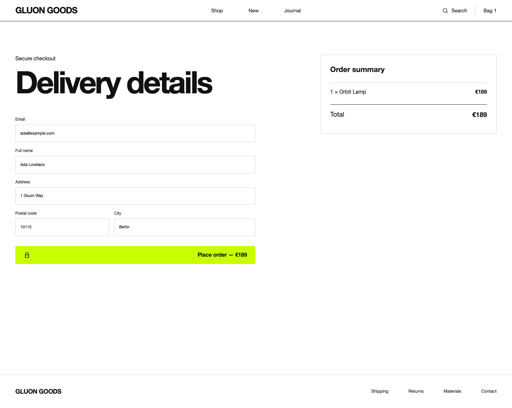
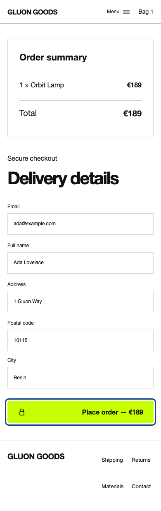

# Typed UI extensibility contract

Official UI components expose native element customization through the named
`attributes` property. `FormField` uses `attributes` for its `input` inherited
from `InputProps` and `fieldAttributes` for its outer `label`. `q.<tag>()` is the
native factory itself, so its props object is the extension object rather than a
nested `attributes` object.

`QuarkProps<ElementType>` derives ordinary scalar properties, explicit
`.property` and `?boolean` bindings, refs, and native value types from the
actual DOM element interface. It separately types `@event`, common `onEvent`,
ARIA, `data-*`, class, and style bindings. The normal type has no
`Record<string, unknown>` index signature. Use an object literal with
`satisfies QuarkProps<ElementType>` to retain excess-property diagnostics.

TypeScript cannot validate every relationship in the HTML and ARIA standards.
It cannot, for example, prove that an ID referenced by `aria-describedby`
exists, that a `data-*` name is meaningful to an application, or that a string
attribute value is accepted by a particular browser version. Runtime semantic
guards remain in `Dialog`, `Icon`, `Button`, and other components. A reviewed
vendor or not-yet-typed platform extension can use
`unsafeQuarkProps<ElementType>()`; that visibly unsafe function only opts out of
key checking and adds no runtime validation.

## Stable extension matrix

| Layer and stable entry | Native target and extension | Protected semantics |
| --- | --- | --- |
| Quark `q` / `quark` / `fragment` | `q.<tag>(QuarkProps<HTMLElementTagNameMap[tag]>)`; custom `quark()` tags use `HTMLElement`; `fragment` has no element or native extension | Native element semantics belong to the selected tag; void elements reject children |
| Quark `createFocusScope` | Behavior over a caller-owned `HTMLElement`; no rendered element or attributes | Focus activation, containment, restoration, and explicit deactivation |
| Quark `Overlay` | `attributes: QuarkProps<HTMLDivElement>` without `children` | The wrapper owns children and composes caller pointer listeners before dismissal |
| Quark `Dialog` | `attributes: QuarkProps<HTMLDivElement>` without children, role, or naming/modal ARIA keys | `label`/`labelledBy`, `modal`, and `onDismiss` explicitly own dialog naming, role, modal state, and Escape behavior |
| Quark `Popover` | `attributes: QuarkProps<HTMLDivElement>` without children, id, or popover mode | `id` and `mode` are explicit props |
| Quark `Listbox` | `attributes: QuarkProps<HTMLDivElement>` without children, id, role, label, or active-descendant | `id`, `label`, `value`, options, and keyboard selection own the ARIA listbox contract |
| Quark `Field` | `attributes: QuarkProps<HTMLLabelElement>` without children | Visible label/helper/error composition stays intact |
| Atom `Button` | `attributes: QuarkProps<HTMLButtonElement>` without children, type, or disabled bindings | `children`/`label`, `type`, and `disabled` are explicit; preset and caller click listeners compose, and cancellation suppresses the higher-level callback |
| Atom `Icon` | `attributes: QuarkProps<SVGSVGElement>` without children, role, size/viewBox, or label/hidden ARIA | No label is decorative and `aria-hidden`; a label is informative with `role=img`; `defineIcon()` supplies only geometry/body |
| Atom `Input` | `attributes: QuarkProps<HTMLInputElement>` without its explicit value, placeholder, type, name, disabled, or invalid bindings | Explicit props own the live value property and validation semantics |
| Atom `Label` | `attributes: QuarkProps<HTMLSpanElement>` without children | Visible label content is explicit |
| Atom `installUiTheme` | Stylesheet owner; no rendered element or attributes | Theme ownership remains explicit and reference-counted |
| Molecule `Card` | `attributes: QuarkProps<HTMLElement>` for its article, without children | Card title, media, actions, and body structure are explicit |
| Molecule `FormField` | inherited Input `attributes`; `fieldAttributes: QuarkProps<HTMLLabelElement>` without children | Implicit native label, error alert, and child invalid state stay composed |
| Organism `AppShell` | `attributes: QuarkProps<HTMLDivElement>` without children | Supplied header/navigation/main/footer landmarks remain owned by the organism |

All caller-provided classes are application-owned public hooks. Official
`.gluon-*` implementation classes are not public selectors. Official CSS custom
properties are public hooks: the shared `--gluon-color-*`, `--gluon-space-*`,
`--gluon-radius-*`, `--gluon-font-family`, and `--gluon-focus-width` tokens plus
the Button-specific `--gluon-button-background`, `--gluon-button-color`, and
`--gluon-button-border-color`. Applications own the names and compatibility of
their own classes and variables.

## Branded preset, danger action, custom icon, and composition

```ts
import {
  Icon,
  defineButtonPreset,
  defineIcon,
} from '@gluonjs/atoms';
import { css, html, svg, type TemplateResult } from '@gluonjs/core';
import { defineMolecule } from '@gluonjs/molecules';
import { defineOrganism } from '@gluonjs/organisms';

const purchaseRef: { value?: HTMLButtonElement } = {};
const analytics: string[] = [];
const PurchaseButton = defineButtonPreset({
  displayName: 'PurchaseButton',
  class: 'goods-purchase',
  attributes: { data: { analyticsAction: 'purchase' } },
});
const DangerButton = defineButtonPreset({
  displayName: 'DangerButton',
  class: 'goods-danger',
});
const bagIcon = defineIcon({
  name: 'goods-bag',
  viewBox: '0 0 24 24',
  body: svg`<path d="M6 8h12l1 13H5L6 8zm3 0a3 3 0 0 1 6 0"></path>`,
});

const PurchaseAction = defineMolecule((props: { total: string }): TemplateResult =>
  PurchaseButton({
    children: [Icon({ icon: bagIcon, label: 'Bag' }), ` Buy for ${props.total}`],
    attributes: {
      ref: purchaseRef,
      data: { productAction: 'buy' },
      onClick: () => analytics.push('purchase'),
    },
  }), 'PurchaseAction');

const CheckoutActions = defineOrganism((props: { total: string }): TemplateResult => html`
  <footer>${PurchaseAction(props)}${DangerButton({ label: 'Cancel order' })}</footer>
`, 'CheckoutActions');

export const appExtensionStyles = css`
  .goods-purchase { --gluon-button-background: #171717; --gluon-button-color: #fff; }
  .goods-danger { --gluon-button-background: #a52222; --gluon-button-color: #fff; }
`;
```

`ButtonVariant`, `ButtonSize`, and `IconName` stay closed unions. Applications
extend behavior through presets, app-owned classes/custom properties, or an
explicit `IconDefinition`, not by passing arbitrary variant or icon strings.
`defineIcon()` requires an `svg` template body and throws before rendering when
the name/view box is empty or an HTML template crosses that namespace boundary.
The Button preset cannot replace `children`, `type`, or disabled semantics
through `attributes`; intentional changes use the corresponding top-level prop.

## Component-definition helper boundary

`defineAtom`, `defineMolecule`, and `defineOrganism` return the supplied
stateless render function and add only immutable, enumerable `layer` and
`displayName` metadata. They do not create a Custom Element, register anything,
adopt styles, install a theme, add lifecycle or state ownership, validate props,
merge attributes, add accessibility semantics, or arrange cleanup. Stateful
reusable Custom Element boundaries use `GluonElement`; applications explicitly
own styles, runtime mounting, events, and cleanup around functional components.

## GLUON GOODS verification evidence

The reference shop uses public Button presets for header/dialog actions,
product add/retry, and bag quantity/remove controls, while catalog search uses
the official `Input`. Its stateful form-associated product configurator keeps
the same Custom Element/ShadowRoot boundary and composes the functional Button
inside it. Checkout repeats official `FormField` five times, composes the
app-local `PurchaseAction` Molecule, and renders the one-form
`CheckoutExperience` Organism. App styling targets its own classes and the
documented public tokens; the shop boundary rejects `.gluon-*` implementation
class dependencies.

The verified desktop, 390px, and 320px states preserve the shop's white,
near-black, chartreuse, cobalt, thin-rule, and square-control system:





Additional issue #114 captures are linked from the
[shop verification contract](../examples/shop/README.md#verification-contract).
