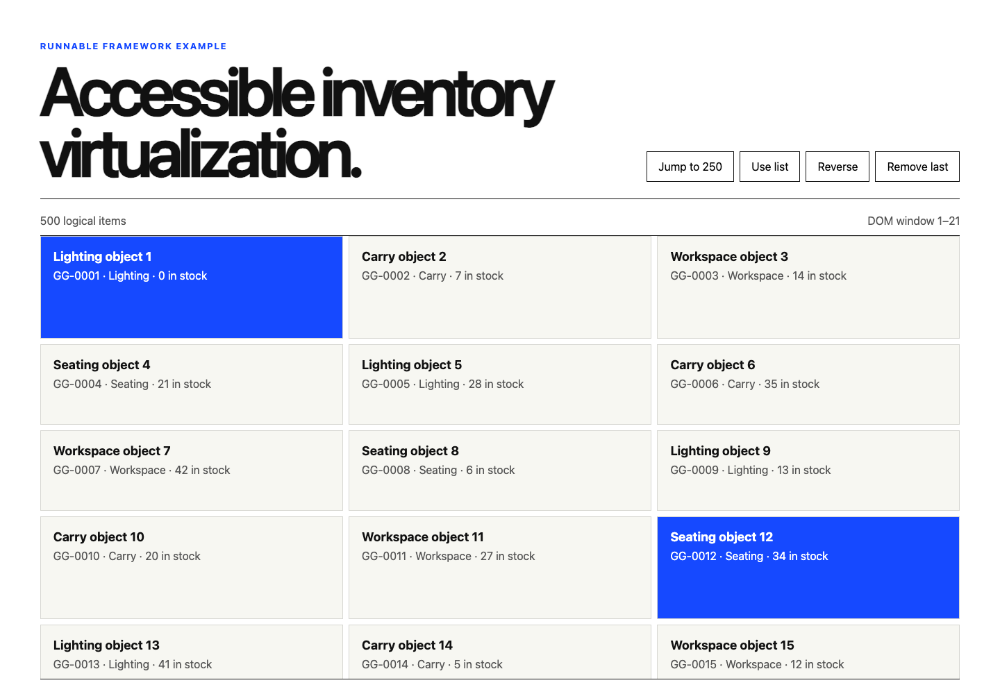

# Gluon virtualizer example

This runnable acceptance application exercises `createVirtualizer()` against a
500-item typed inventory. It is deliberately separate from GLUON GOODS: the
canonical shop has only four products, so windowing that customer route would
add complexity without reducing meaningful DOM work.



The retained desktop and 390px renders are generated from the runnable app;
`design/render-mobile.png` records the single-column mobile grid contract.

The example demonstrates:

- bounded list and three-column grid layouts;
- stable keys, overscan, mixed estimated/dynamic row sizes, and viewport resize;
- programmatic navigation and keyboard focus into an off-screen item;
- reorder and removal updates without rendering the complete collection;
- list/grid semantics and logical collection position metadata;
- callback-ref observer/listener ownership and application cleanup.

Run it from the repository root:

```sh
npm run dev:virtualizer-example
```

Build verification is available through `npm run build:virtualizer-example`.
Browser, SSR, hydration, public type, documentation, and cleanup evidence lives
in the repository quality suite.
